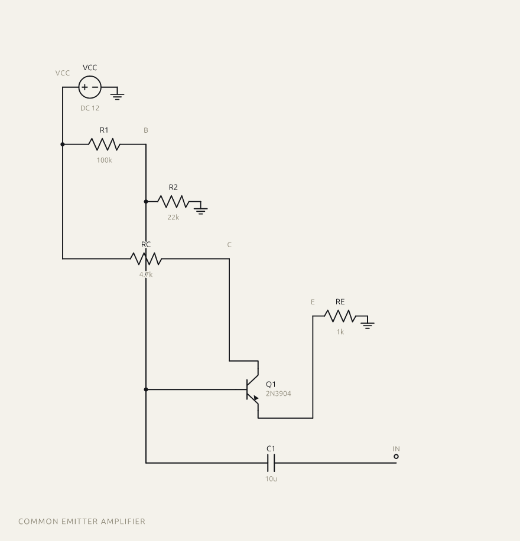
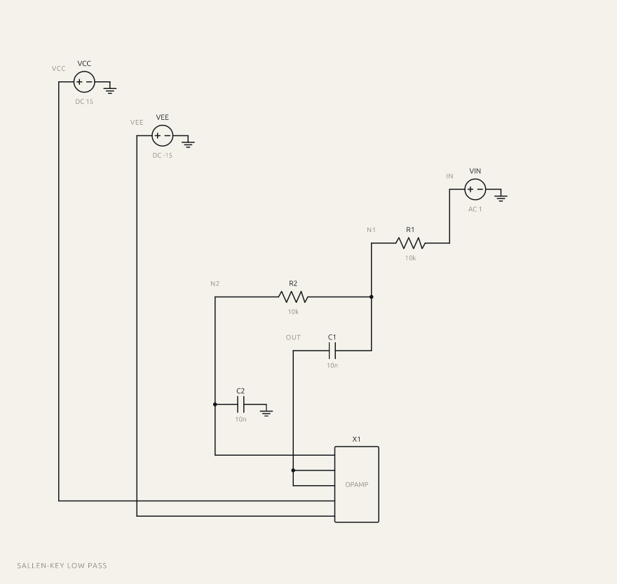
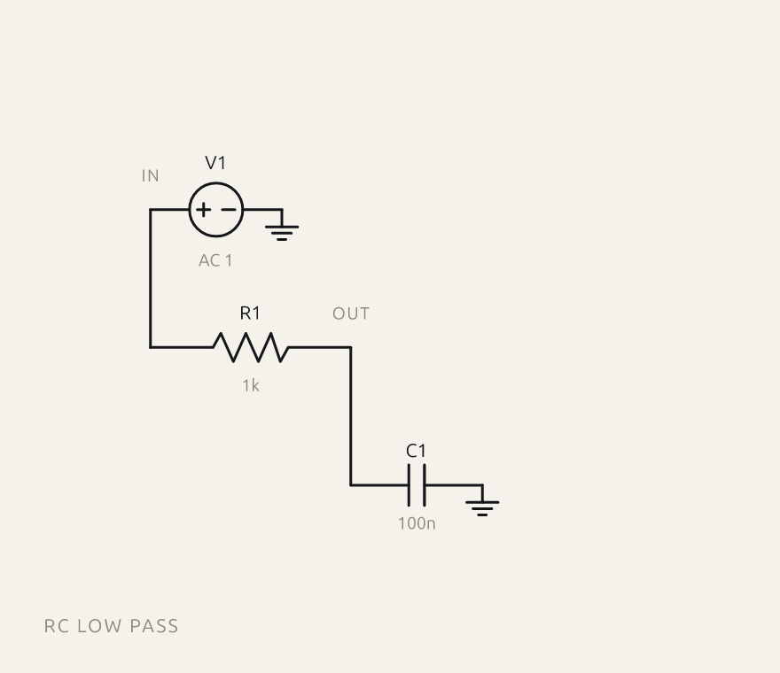
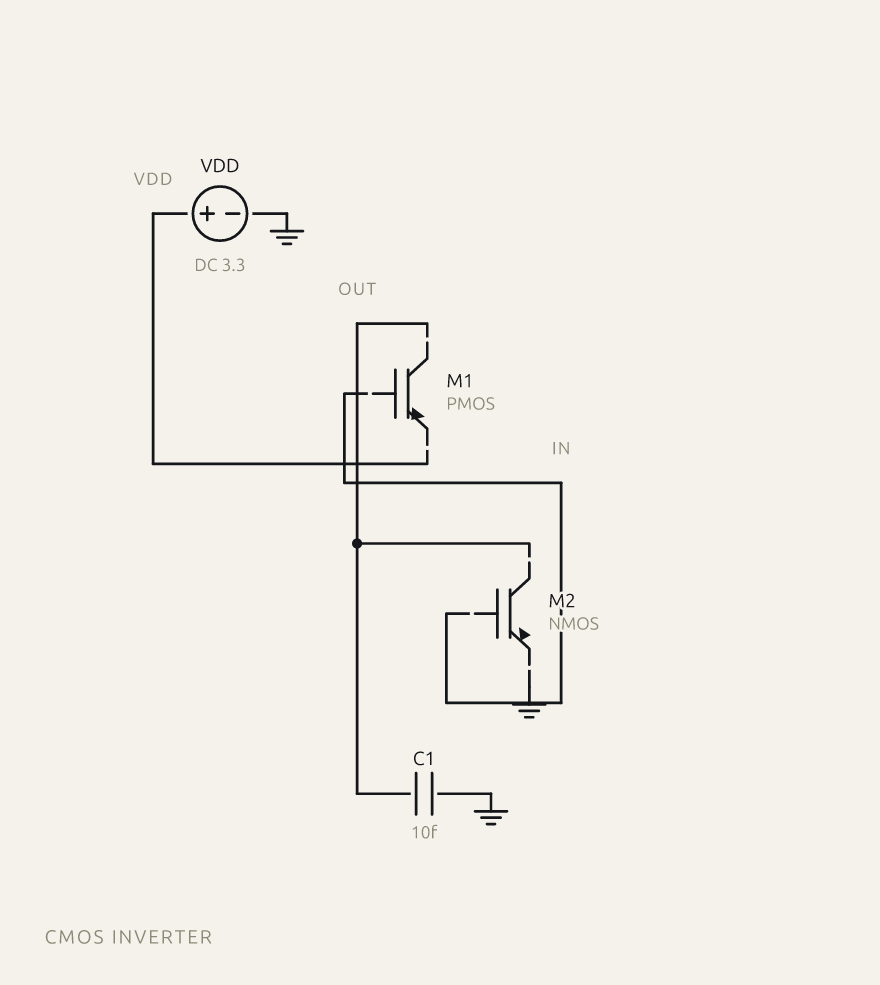
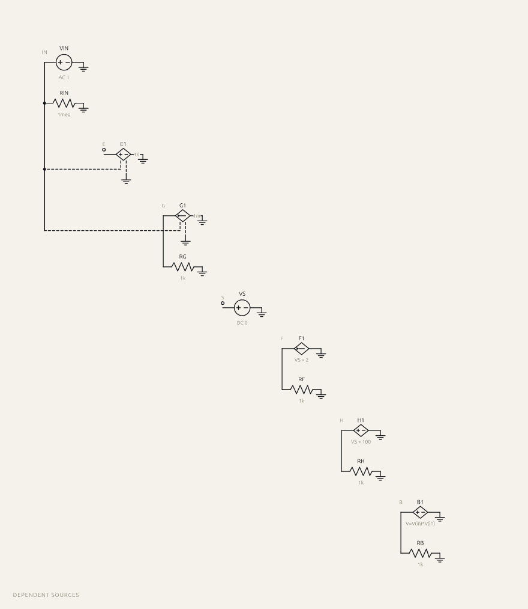
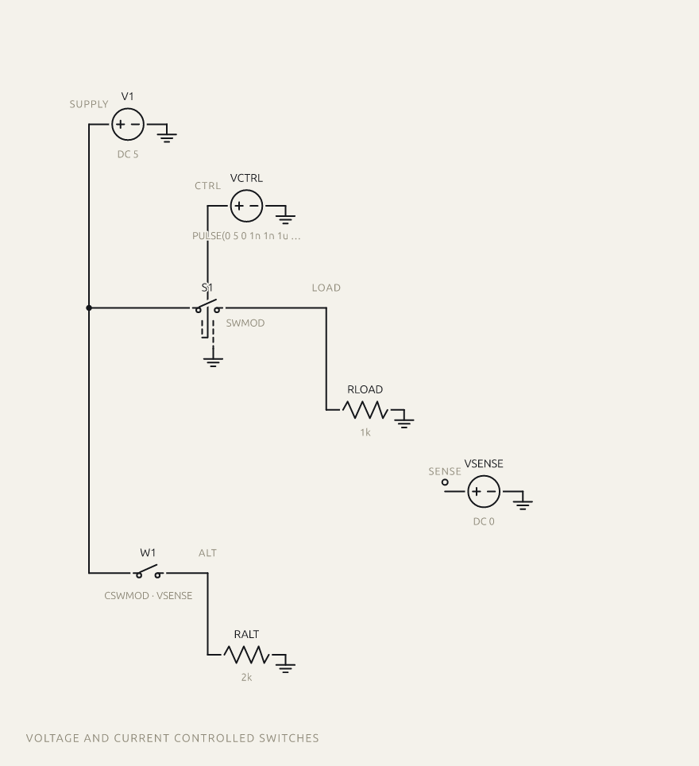
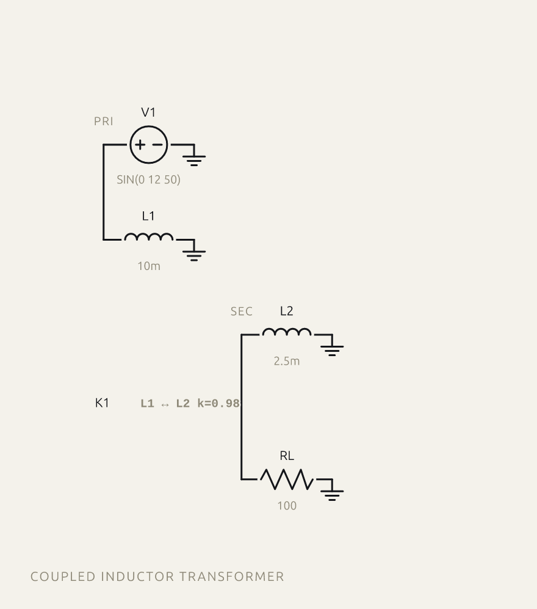
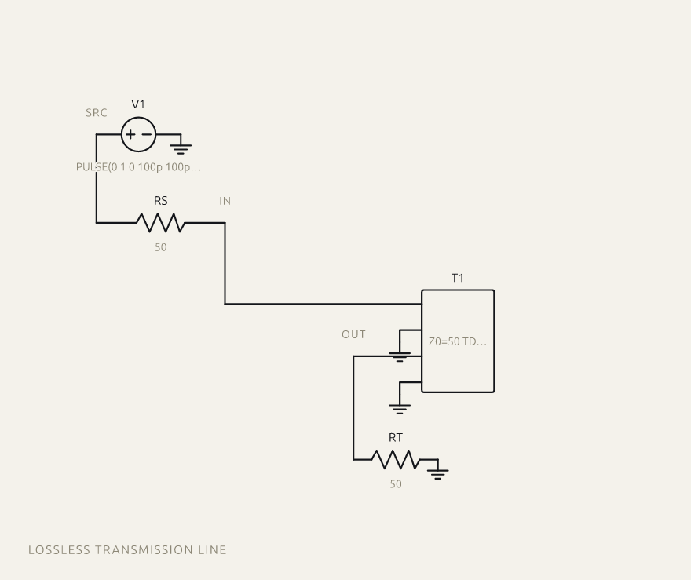

# spice-schematic

Turn a SPICE netlist into a schematic — as a React component, or as a plain SVG string with no DOM in sight.

**[Try it in the browser →](https://indreshp135.github.io/spice-schematic/)** — paste a netlist, watch it draw, download the SVG.

```bash
npm install spice-schematic
```

<p align="center">
  
</p>

## Use it

**As a React component**

```tsx
import { Schematic } from 'spice-schematic/react';

export default function App() {
  return <Schematic netlist={`
    V1 in 0 DC 5
    R1 in out 1k
    C1 out 0 100n
  `} style={{ width: '100%' }} />;
}
```

**As an SVG string** — works in Node, a worker, a build step, anywhere:

```ts
import { renderToSvgString } from 'spice-schematic';
import { writeFileSync } from 'node:fs';

writeFileSync('schematic.svg', renderToSvgString(netlist));
```

The React entry is a separate export, so importing `spice-schematic` on a server never pulls React in.

## What it draws

**All 26 SPICE element types.** A device's type is the first character of its
refdes, so A–Z is the entire element universe — this table is exhaustive by
construction rather than by best effort, and `test/coverage.test.js` asserts
every letter parses and draws.

| Letter | Device | Drawn as |
| --- | --- | --- |
| `A` | XSPICE code model | labelled block |
| `B` | behavioural source | diamond |
| `C` | capacitor | two-terminal symbol |
| `D` | diode | two-terminal symbol |
| `E` | VCVS | diamond |
| `F` | CCCS | diamond |
| `G` | VCCS | diamond |
| `H` | CCVS | diamond |
| `I` | current source | circle with polarity or current arrow |
| `J` | JFET | vertical transistor |
| `K` | coupled inductors | annotation (no nodes) |
| `L` | inductor | two-terminal symbol |
| `M` | MOSFET | vertical transistor |
| `N` | numerical device | labelled block |
| `O` | lossy transmission line | labelled block |
| `P` | coupled multiconductor | labelled block |
| `Q` | BJT | vertical transistor |
| `R` | resistor | two-terminal symbol |
| `S` | voltage-controlled switch | switch contacts and lever |
| `T` | lossless transmission line | labelled block |
| `U` | distributed RC line | labelled block |
| `V` | voltage source | circle with polarity or current arrow |
| `W` | current-controlled switch | switch contacts and lever |
| `X` | subcircuit call | labelled block |
| `Y` | lossy line (TXL) | labelled block |
| `Z` | MESFET | vertical transistor |

Voltage-controlled devices (`E`, `G`, `S`) carry sense nodes in addition to their
terminals; those are drawn as **dashed** leads so a control connection is never
mistaken for a current-carrying wire. Current-controlled devices (`F`, `H`, `W`)
name a controlling source instead, and `K` has no nodes at all — it links two
inductors, so it renders as an annotation rather than a symbol on a rail.

### Netlist semantics

- **Node names are case-insensitive**, as SPICE defines them — `IN` and `in` are
  one node, not two rails
- **In-line comments** (`;`, and `$` after whitespace) are stripped before a card
  is split into fields; left in, `Q1 c b e 2N3904 ; note` reads the model name as
  the substrate terminal
- **Line continuations** (`+`) are joined, per physical line, so a comment on a
  continuation cannot swallow the card it continues
- **`.end` terminates the deck**; `.ends` and `.endc` are not mistaken for it
- **The first line is the title** by SPICE convention — but only when it cannot be
  read as an element card, so a pasted fragment keeps its first component
- **`.subckt`/`.ends` and `.control`/`.endc` bodies are skipped** — their contents
  are definitions and commands, not circuit elements

Anything the parser cannot place is reported in `skipped` rather than dropped in
silence.

Two known gaps. A MOSFET bulk or BJT substrate terminal has no pin on the
three-terminal symbol used, so a bulk tied to its own net is not drawn — it stays
in `ParseResult.nets` but is absent from `Scene.nets`, which lists only what
reached the sheet.

And controlled sources written in the `POLY`, `VALUE` or `TABLE` forms
carry two terminals plus an expression, and their control nodes cannot be told
apart from coefficients without evaluating the expression. Those nets are not
drawn. Nothing false is drawn either — the two terminals are correct — but the
sheet is missing a connection the netlist has.

## How the layout works

A netlist records connectivity and nothing else. There are no coordinates in it, so a renderer has to invent a placement:

- every net becomes a **vertical rail**, ordered by breadth-first walk from the first voltage source, so supply sits left and signal reads across the page
- a rail only spans the rows between its first and last pin, so nets that cannot collide **share a column** — without this a deck of mostly-isolated devices is as wide as it is long, and almost entirely whitespace
- every component gets its **own row**, drawn between the rails it connects
- **ground gets no rail** — just a ground symbol at each pin, which removes what would otherwise be the busiest net on the sheet
- **junction dots** appear only where a lead meets a rail mid-run, never at a rail's endpoints, so a dot always means a real T

<p align="center">
  
</p>

### What this will not do

It gives you a drawing that is **correct and traceable, not textbook-pretty**. Recognising that a pair of transistors is a differential pair, or that a capacitor is feedback and belongs drawn as an arc over the amplifier, requires inferring the circuit's intent — this library does not attempt it. On densely connected nodes, leads to three-terminal devices can cross rails. `highlightNet` exists partly to make those cases readable.

## API

### `renderToSvgString(netlist, options?): string`

| Option | Type | Effect |
| --- | --- | --- |
| `theme` | `Partial<Theme>` | override `ink`, `paper`, `dim`, `accent`, `fontFamily`, `strokeWidth` |
| `highlightNet` | `string` | draw that net and every lead touching it in the accent colour |
| `responsive` | `boolean` | emit only a `viewBox`, letting CSS size the element |

### `<Schematic />`

Takes everything `renderToSvgString` takes, plus any `<svg>` prop, plus:

| Prop | Type | Effect |
| --- | --- | --- |
| `onParse` | `(r: ParseResult) => void` | fires on netlist change — read `skipped` from it to surface bad lines |
| `onNetHover` | `(net: string \| null) => void` | pair with `highlightNet` for hover-to-trace |
| `onNetClick` | `(net: string) => void` | click any mark belonging to a net |

Hover-to-trace in full:

```tsx
const [hot, setHot] = useState<string | null>(null);
return <Schematic netlist={src} highlightNet={hot ?? undefined} onNetHover={setHot} />;
```

### Lower level

```ts
import { parseSpice, layout, sceneToSvg } from 'spice-schematic';

const parsed = parseSpice(netlist);  // { title, components, nets, skipped }
const scene = layout(parsed);        // { width, height, nets, shapes }
const svg = sceneToSvg(scene);
```

`layout()` returns a flat list of tagged shapes — `path`, `circle`, `rect`, `text` — each carrying the net it belongs to where it belongs to one. Both renderers are thin passes over that list, so writing a third (canvas, PDF, a different JSX dialect) means walking one array. `useSchematic(netlist)` is the same thing as a hook.

## Interop and alternative layouts

### `toYosysJson(netlist, options?)`

Emits [Yosys JSON](https://yosyshq.readthedocs.io/), so a SPICE deck can be fed
to [netlistsvg](https://github.com/nturley/netlistsvg) or any Yosys-JSON tool:

```ts
import { toYosysJson } from 'spice-schematic';
import netlistsvg from 'netlistsvg';

const { json, dropped } = toYosysJson(netlist);
const svg = await netlistsvg.render(analogSkin, json);
```

**Check `dropped`.** Yosys JSON is a digital format and netlistsvg's analog skin
has symbols for seven SPICE letters — `R C L D V I Q`. There is no FET symbol at
all, so a CMOS inverter loses both transistors. Nothing is omitted silently;
every unrepresentable component is reported with a reason.

Two things the format forces, both layout hints rather than facts about the
circuit: analog pins have no direction, yet `port_directions` must be supplied
and netlistsvg lays out along them; and the skin ships separate horizontal and
vertical symbols, so orientation is the caller's choice too.

### `layoutWithElk(parsed, options?)` — experimental

An alternative layout over [ELK](https://github.com/kieler/elkjs)'s graph
algorithms, in the optional `spice-schematic/elk` entry. `elkjs` is an optional
peer dependency; importing the core never pulls it in.

```ts
import { parseSpice, sceneToSvg } from 'spice-schematic';
import { layoutWithElk } from 'spice-schematic/elk';

const svg = sceneToSvg(await layoutWithElk(parseSpice(netlist)));
```

**It is not the default, because measured against the rail layout it is worse.**
On the common-emitter example it is smaller (436×653 against 754×832) but harder
to read: junction dots end up on stubs, routed edges loop around the transistor,
and net labels are gone. `force` and `stress` are worse still — they place well
but route diagonally, and schematics need orthogonal wires.

The cause is structural. ELK's `layered` algorithm orders nodes along a
direction, and an analog circuit does not have one; a direction has to be
invented per pin, and it drives the result. netlistsvg's good analog examples
carry hand-authored directions and per-component orientations, which is
placement supplied by a person rather than inferred.

It is kept because it works, is tested, and proves the `Scene` seam takes a
second engine — swapping layouts touched no parser, symbol or renderer code.
Both layouts draw from `src/symbols.ts`, so a resistor is the same zigzag in
either, and a test asserts it.

## More examples

`examples/` holds these netlists and their rendered SVGs. Regenerate with `npm run examples`.

| | |
| --- | --- |
|  |  |
| `rc-lowpass.cir` | `cmos-inverter.cir` |
|  |  |
| `dependent-sources.cir` — E, F, G, H, B | `switches.cir` — S and W |
|  |  |
| `transformer.cir` — K coupled inductors | `transmission-line.cir` — T |

`all-elements.cir` is a coverage sheet rather than a circuit: one card of every
letter A–Z. It exists to prove every symbol draws, and it is what column packing
was built for — 50 nets fold into a handful of columns instead of 50.

## Development

```bash
npm install
npm run build
npm test        # 152 tests: elements, geometry, SVG validity, demo UI
npm run demo    # Vite playground — paste a netlist, watch it draw
```

The playground is published to GitHub Pages from the `gh-pages` branch.
Rebuild and republish it with `./scripts/deploy-pages.sh`.

## License

MIT
